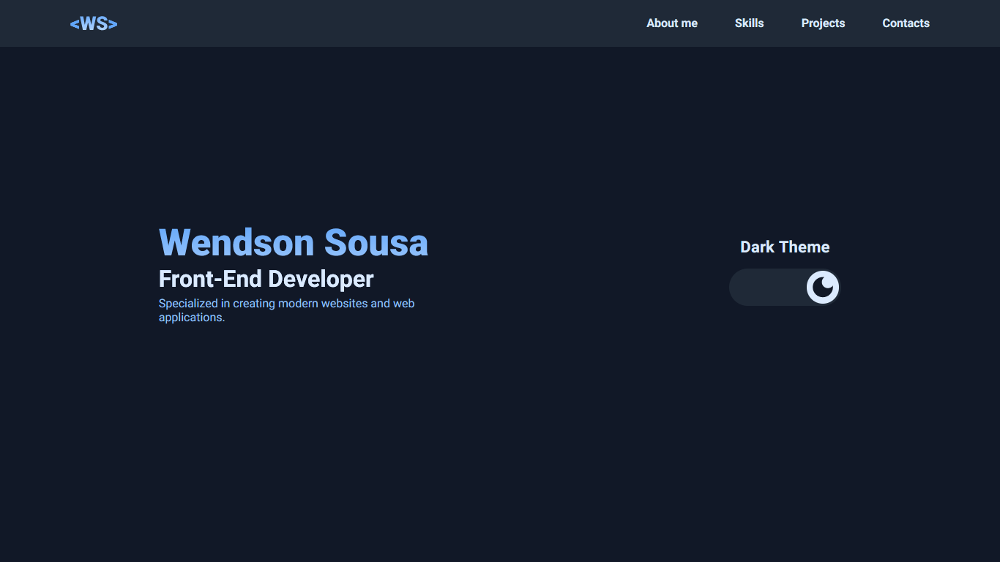

# 



## ✨ Tecnologias

- [Typescript](https://www.typescriptlang.org/)
- [Next JS](https://nextjs.org/)
- [Next Translate](https://github.com/aralroca/next-translate)
- [Styled Components](https://tailwindcss.com/)
- [React Icons](https://react-icons.github.io/react-icons/)
- [Axios](https://github.com/axios/axios)
- [Swiper JS](https://swiperjs.com/)
- [Eslint](https://eslint.org/)
- [Prettier](https://prettier.io/)

## 🧑‍💻 Como executar

Clone o projeto e acesse sua pasta

```bash
$ git clone https://github.com/wendsondev/portfolio.git
$ cd portfolio
```

Instale as dependências e execute o projeto com yarn ou npm

```bash
# instalar dependências
$ yarn
  ou
$ npm i

# executar o projeto
$ yarn dev
  ou
$ npm run dev
```

acesse o projeto em [localhost:3000](http://localhost:3000) em seu navegador.

## 📌 Layout

layout usado no projeto no link abaixo

- [layout web](https://www.figma.com/community/file/1176098420505083930)

## 📝 License

Esse projeto está sob a licença MIT. Veja [LICENSE](LICENSE) para mais detalhes.
